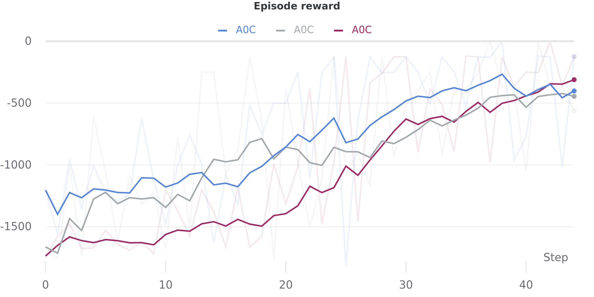

# What is this
This repo contains multiple, self-contained implementations of AlphaZero. 
They are based on this repo https://github.com/tmoer/alphazero_singleplayer
as well as the following paper [A0C: Alpha Zero in Continuous Action Space](https://arxiv.org/pdf/1805.09613.pdf).  
The discrete agent is tested and works on the gym environment _CartPole_.
You should be able to train it in a couple of minutes even on a laptop.  
The continuous agent is tested on _Pendulum_. Here training time is longer
but if your laptop is decent it shouldn't take more than an hour.  
It uses a squashed Normal distribution as stochastic policy compared to a transformed beta distribution in A0C. More on the squashed Normal distribution and the SAC algorithm can be found [here](https://github.com/denisyarats/pytorch_sac) (reference implementation) and [here](https://arxiv.org/abs/1801.01290) (paper).  

## Getting started
1. Install the conda environment from the `env.yaml` file. It should contain all the needed dependencies.  
2. If you want to use Weights & Biases, you will have to enter your own credentials.  
3. Execute the `run_discrete.py` file for training a _CartPole_ agent or
    execute the `run_continuous.py` file for training a _Pendulum_ agent.

#### WARNING 1
The code in this repository has been used as experimental prototype for my thesis.
While it is working, it is not fully documented yet.

#### WARNING 2
Currently the transformed beta policy is not working.

## Example results for Pendulum 

  

_Note_: A step here refers to an episode.

## Project structure
    .
    ├── alphazero   # Main project folder
    |   ├── agent    # Agent implementation
    |   |   ├── agents.py     # Implementation of the continuous and discrete agent
    |   |   ├── buffers.py    # Replay buffer
    |   |   └── losses.py     # Contains discrete loss, a0c loss, tuned a0c loss
    |   |
    |   ├── network    # Implementations for various stochastic policies
    |   |   ├── distributions.py    # Contains the SAC squashed normal distribution and transformed beta distribution
    |   |   ├── policies.py         # Discrete and continuous policy network
    |   |   └── utils.py            # Some helpers for initialization
    |   |
    |   ├── search    # MCTS implementation
    |   |   ├── mcts.py      # Discrete and continuous (using progressive widening) MCTS
    |   |   └── states.py    # MCTS edge and node implementations for discrete and continuous case
    |   |
    |   └── helpers.py    # helper functions like argmax with random tiebreak
    |
    ├── config    # Soft Actor-Critic implementation
    |   ├── agent       # Configuration files for different agents
    |   |
    |   ├── loss        # Configuration files for different losses
    |   |
    |   ├── mcts        # Configuration files for discrete/continuous MCTS
    |   |
    |   ├── optimizer   # Adam/RMSProp configuration files
    |   |
    |   ├── policy      # Configurations for the discrete and continuous network
    |   |
    |   ├── requirements.txt    # Pip requirements
    |   └── helpers.py    # helper functions like argmax with random tiebreak
    |    
    ├── rl    # Helpers and wrappers for OpenAI Gym
    |
    ├── utils # Utility functions (not fully implemented)
    |
    ├── env.yml             # Conda environment for setup
    ├── mypy.ini            # Mypy configuration file (checks typing)
    ├── pyproject.toml      # Black formatter configuration file
    ├── run_continous.py    # Train and execute a continuous agent
    └── run_discrete.py     # Train and execute a discrete agent

## Branches

#### master branch
PyTorch AlphaZero implementation. Contains an AlphaZero version for discrete action spaces and a modified A0C implementation for continuous action spaces (using the SAC squashed Normal policy).

#### tf branch
AlphaZero implementation for OpenAI gym by the original author. Kept as reference.
Uses Tensorflow 1.x instead of Pytorch  

## TODOS
- [ ] Add documentation
- [ ] Add discretized agent.
- [ ] Fix typing.
